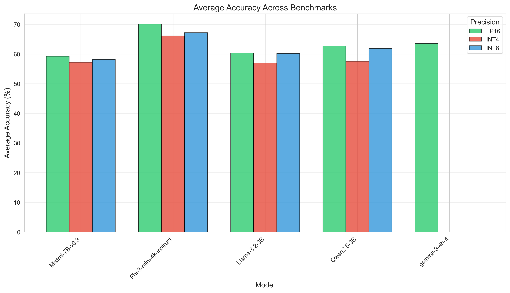
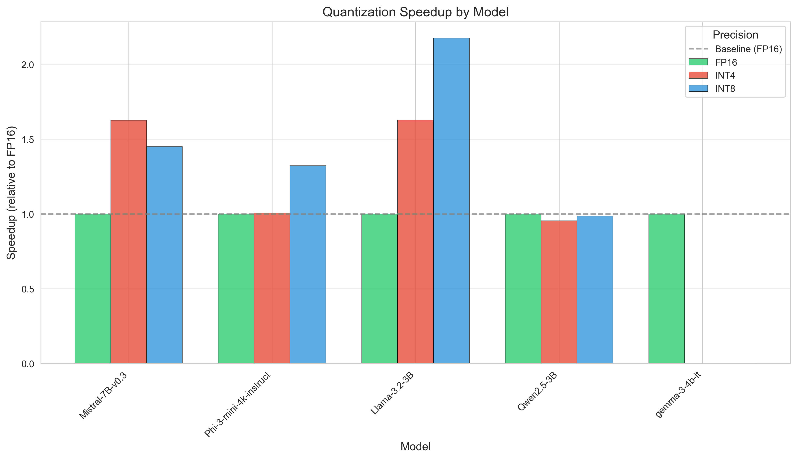
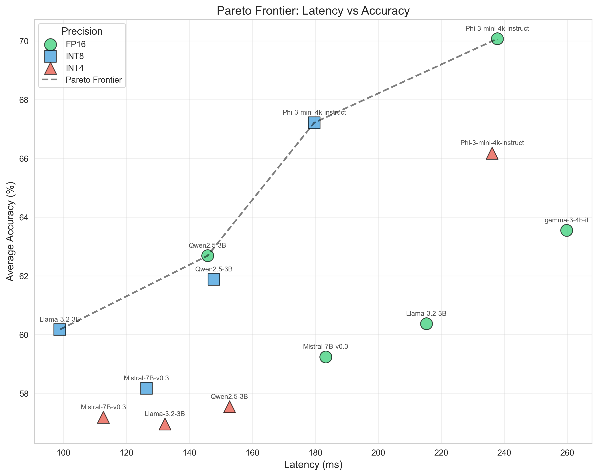
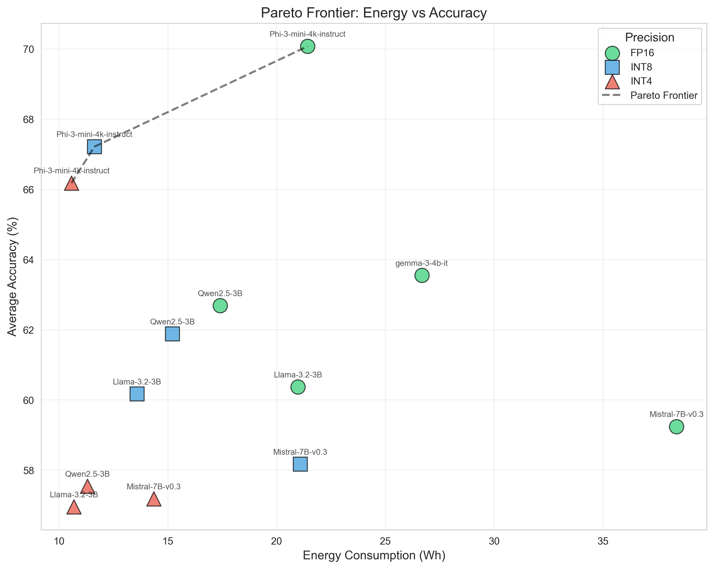
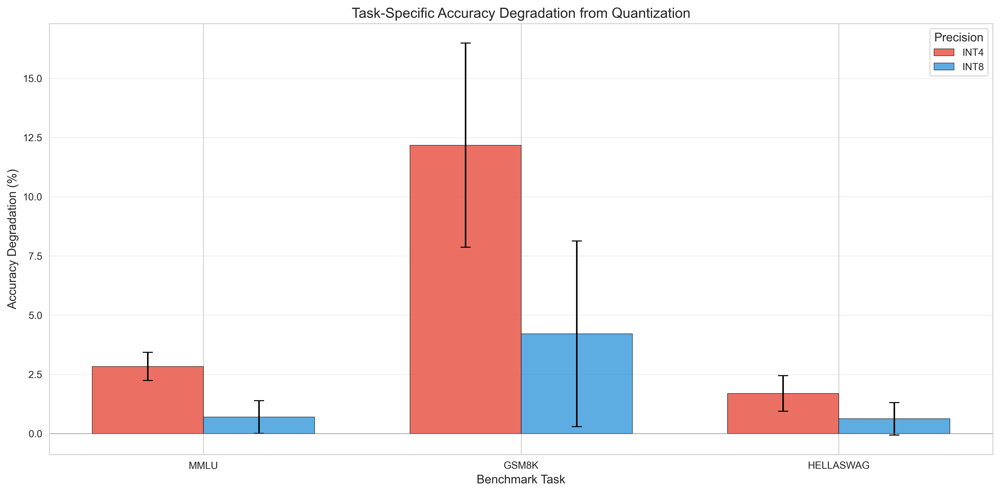
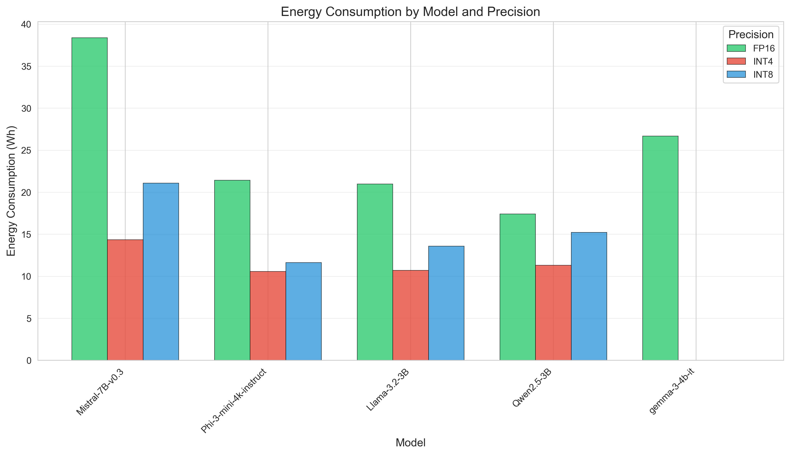

# SLiM-Eval

**Small Language Model Evaluation Framework** — Comprehensive benchmarking for quantized LLMs across performance, energy, and accuracy metrics.

[](https://pypi.org/project/slim-eval/)
[](https://www.python.org/downloads/)
[](LICENSE)

## Team Information

- **Team Name**: SLiM-Eval
- **Members**:
  - Vishruth Devan (vd2461)
  - Kavin Aravindhan Rajkumar (kr3131)

---

## 1. Problem Statement

Current SLM evaluation practices suffer from three fundamental and interconnected gaps:

**Gap 1: Efficiency-Blind Benchmarking.** Standard evaluation protocols measure correctness (accuracy, F1, BLEU) while ignoring dimensions critical for deployment: inference latency, throughput, memory footprint, and energy consumption. A model ranking first on MMLU may rank last in production viability due to prohibitive latency or energy costs.

**Gap 2: Absence of Quantization-Aware Evaluation.** While quantization is ubiquitous in production systems, existing benchmarks evaluate models predominantly at baseline precision (FP16/FP32). The relationship between quantization aggressiveness and task-specific accuracy degradation remains uncharacterized, forcing practitioners into conservative precision choices that sacrifice efficiency gains.

**Gap 3: Lack of Multi-Objective Optimization Frameworks.** SLM deployment inherently requires balancing conflicting objectives like maximizing accuracy while minimizing latency, memory, and energy. However, benchmarks report single-dimensional rankings rather than multi-objective trade-off analyses revealing optimal deployment configurations.

To address these gaps, we introduce **SLiM-Eval**, a systematic framework for evaluating SLMs across accuracy–efficiency trade-offs under quantization. We evaluate five representative instruction-tuned SLMs (Qwen2.5-3B, Llama-3.2-3B, Phi-3-mini-4k, Gemma-3-4B, and Mistral-7B) across FP16, INT8, and INT4 precision on MMLU, GSM8K, and HellaSwag, with over 200 hours of controlled experiments on NVIDIA A100 GPUs.

📊 **[View Full Experiment Logs on Weights & Biases](https://wandb.ai/slim-eval/slim-eval/reports/SLiM-Eval-Systematic-Evaluation-of-Quantization-Trade-offs-in-Small-Language-Models--VmlldzoxNTQwNjM2Ng?accessToken=lo8foveel7p8681kqe9nm949vt7rnmg8yrtg6t2yn5i8xq9gs7iq60kqz8kzckgc)**

---

## Overview

SLiM-Eval is a unified framework for evaluating Large Language Models (LLMs) with different quantization strategies. It measures:

- **Performance**: Latency (TTFT, TPOT, E2E) and GPU memory usage
- **Energy**: Power consumption and energy efficiency
- **Accuracy**: Model quality on standard benchmarks (MMLU, GSM8K, HellaSwag)

### Supported Quantization Methods

| Precision | Method | Description |
|-----------|--------|-------------|
| `fp16` | Baseline | Half-precision floating point (no quantization) |
| `int8` | GPTQ | 8-bit weights and activations (W8A8) |
| `int4` | GPTQ | 4-bit weights, 16-bit activations (W4A16) |

## Installation

### Prerequisites

- Python 3.10+
- CUDA-capable GPU (recommended)
- CUDA 11.8+ and cuDNN

### Setup

We recommend using [uv](https://github.com/astral-sh/uv) for fast, reliable Python environment management and installation.

```bash
uv venv
source .venv/bin/activate
uv pip install "slim-eval[all]"
```

## Quick Start

### Environment Setup

Set up the required environment variables before running benchmarks:

```bash
# Required for accessing gated models (e.g., Llama, Gemma)
export HF_TOKEN=your_huggingface_token

# Optional: Enable Weights & Biases logging
export WANDB_API_KEY=your_wandb_api_key
```

### Basic Usage

Run a complete benchmark suite on a model:

```bash
slim-eval run \
  --models "meta-llama/Llama-3.2-3B-Instruct" \
  --precision fp16 \
  --output-dir outputs
```

This will run the full benchmark suite with:

- 10 warmup runs + 500 measured runs for stable statistics
- Batch size of 8 for improved throughput
- 256 token generation
- Full accuracy evaluation (MMLU, GSM8K, HellaSwag) with 5-shot
- 200 energy sample runs for stable power estimates
- Weights & Biases logging enabled by default

To run multiple precisions, execute separate commands for each:

```bash
slim-eval run --models "meta-llama/Llama-3.2-3B-Instruct" --precision fp16 --max-model-len 8192
slim-eval run --models "meta-llama/Llama-3.2-3B-Instruct" --precision int8 --max-model-len 8192
slim-eval run --models "meta-llama/Llama-3.2-3B-Instruct" --precision int4 --max-model-len 8192
```

---

### Troubleshooting: Quantization & CUDA OOM Errors

After quantization completes and metric evaluation starts, you may sometimes encounter a CUDA out-of-memory (OOM) error. This can happen if the GPU memory is over-allocated during evaluation.

- **Recommended Fix:** Reduce the `--gpu-memory-utilization` parameter (e.g., set `--gpu-memory-utilization 0.6` or lower) to ensure there is enough free memory for evaluation.
- **Quick Fix:** Simply re-run the same command. If quantization has already completed, the quantized model is saved locally and will be loaded directly, so the process will resume from evaluation without repeating quantization.

If quantization fails or the CUDA process crashes, it's possible that partially quantized files remain in the `quantized-models/` directory. To resolve this:

- **Clean Up:** Delete the affected model's directory inside `quantized-models/` to remove any incomplete or corrupted files. Then, re-run your command to trigger a fresh quantization.

---

### Performance-Only Benchmark

Quick latency and memory profiling (reduced runs for faster results):

```bash
slim-eval run \
  --models "meta-llama/Llama-3.2-3B-Instruct" \
  --precision fp16 \
  --tasks performance \
  --num-runs 50 \
  --num-warmup 5
```

### Accuracy Evaluation

Run model quality benchmarks (uses 5-shot by default):

```bash
slim-eval run \
  --models "meta-llama/Llama-3.2-3B-Instruct" \
  --precision fp16 \
  --tasks accuracy \
  --accuracy-tasks "mmlu gsm8k hellaswag"
```

### Analyze Previous Results

Generate visualizations from saved results:

```bash
slim-eval analyze --input-dir outputs --output-dir analysis_results
```

## CLI Reference

### Main Command: `slim-eval run`

#### Model & Precision Options

- `--models`: HuggingFace model IDs or local paths (space-separated for multiple)
- `--precision`: Quantization precision to evaluate
  - Choices: `fp16`, `int8`, `int4`
  - Default: `fp16`

#### Benchmark Tasks

- `--tasks`: Space-separated list of benchmarks to run
  - `performance`: Latency & memory usage
  - `energy`: Power consumption tracking
  - `accuracy`: Model quality metrics
  - Default: `performance accuracy energy` (full suite)

#### Performance Benchmark Options

- `--num-warmup`: Warmup iterations before measurement (default: 10)
- `--num-runs`: Number of measured inference runs (default: 500)
- `--batch-size`: Concurrent requests per iteration (default: 8)
- `--prompt`: Input prompt for latency tests (default: "Explain one interesting fact about large language models.")
- `--max-new-tokens`: Tokens to generate per request (default: 256)

#### Energy Benchmark Options

- `--energy-sample-runs`: Number of energy-tracked requests (default: 200)

#### Accuracy Benchmark Options

- `--accuracy-tasks`: Space-separated lm-eval tasks to run (default: `mmlu gsm8k hellaswag`)
- `--num-fewshot`: Few-shot examples (default: 5)
- `--accuracy-limit`: Limit examples per task for quick testing (default: None - run full benchmark)
- `--accuracy-batch-size`: Global batch size (default: 32)
- `--accuracy-batch-size-{task}`: Per-task batch size overrides

#### vLLM Configuration

- `--gpu-memory-utilization`: GPU memory fraction for vLLM (default: 0.8)
- `--max-model-len`: Maximum context window for inference (default: 8192)

#### GPU Selection

- `--gpu-index`: Select NVIDIA GPU index to use, 0-based (default: 0)

#### Weights & Biases Integration

- `--wandb-enabled`: Enable Weights & Biases logging (default: True)
- `--wandb-project`: W&B project name (default: `slim-eval`)
- `--wandb-api-key`: W&B API key (or set `WANDB_API_KEY` env var)
- `--wandb-run-name`: W&B run name (leave empty for auto-generation)

#### Quantization Options

- `--calibration-dataset`: Dataset for calibration (default: `HuggingFaceH4/ultrachat_200k`)
- `--calibration-split`: Dataset split (default: `train_sft`)
- `--num-calibration-samples`: Calibration samples (default: 512)
- `--max-sequence-length`: Max sequence length for calibration (default: 2048)

#### Output Options

- `--output-dir`: Results directory (default: `outputs`)
- `--quantized-models-dir`: Pre-quantized model cache (default: `quantized-models`)

### Analysis Command: `slim-eval analyze`

```bash
slim-eval analyze \
  --input-dir outputs \
  --output-dir analysis_results \
  --accuracy-tasks mmlu gsm8k hellaswag
```

#### Analysis Options

- `--input-dir`: Directory containing benchmark results to analyze (default: `outputs`)
- `--output-dir`: Directory to write analysis results (plots, CSVs, etc.) (default: `outputs`)
- `--accuracy-tasks`: Accuracy tasks to include in analysis (default: `mmlu gsm8k hellaswag`)
- `--gpu-index`: Select NVIDIA GPU index to use (default: 0)

## Repository Structure

```text
SLiM-Eval/
├── slim_eval/                      # Main package
│   ├── __init__.py
│   ├── cli.py                      # Command-line interface (Typer-based)
│   ├── evaluator.py                # Main orchestrator for benchmarks
│   ├── quantization.py             # GPTQ quantization management
│   ├── analysis.py                 # Results visualization & analysis
│   ├── utils.py                    # Utilities (caching, model info)
│   └── benchmarks/
│       ├── __init__.py
│       ├── base.py                 # Base benchmark class
│       ├── performance.py          # Latency & memory tracking (vLLM)
│       ├── energy.py               # Power consumption monitoring (NVML)
│       └── accuracy.py             # lm-eval integration
├── outputs/                        # Benchmark results (per model/precision)
├── quantized-models/               # Cached quantized models
├── analysis_results/               # Generated plots and analysis
│   └── plots/                      # Visualization outputs
├── pyproject.toml                  # Package configuration & dependencies
├── README.md                       # This file
└── LICENSE                         # MIT License
```

### Core Components

| Component | Description |
|-----------|-------------|
| `cli.py` | Typer-based CLI with `run` and `analyze` commands |
| `evaluator.py` | Orchestrates model loading, quantization, and benchmark execution |
| `quantization.py` | GPTQ quantization using llmcompressor with calibration |
| `benchmarks/performance.py` | Measures TTFT, TPOT, E2E latency, throughput via vLLM |
| `benchmarks/energy.py` | GPU power monitoring using NVIDIA Management Library |
| `benchmarks/accuracy.py` | Wraps lm-evaluation-harness for MMLU, GSM8K, HellaSwag |
| `analysis.py` | Generates plots, Pareto analysis, and summary statistics |

## Output Files

After running benchmarks, the output directory contains:

```text
outputs/
└── {model_name}/
    └── {model_name}_{precision}/
        ├── energy.json           # Energy metrics
        ├── gsm8k.json            # GSM8K accuracy results
        ├── hellaswag.json        # HellaSwag accuracy results
        ├── mmlu.json             # MMLU accuracy results
        └── performance.json      # Latency & memory metrics
```

After running analysis:

```text
analysis_results/
├── complete_results.json         # Combined metrics (JSON)
├── executive_summary.txt         # Human-readable summary
├── quantization_impact.csv       # Quantization comparison
├── results_table.csv             # Combined metrics table
├── results_table.tex             # LaTeX table
├── summary_statistics.csv        # Statistical summary
└── plots/
    ├── latency_comparison.png    # Latency visualizations
    ├── memory_comparison.png     # Memory usage charts
    ├── energy_comparison.png     # Energy efficiency plots
    └── accuracy_comparison.png   # Model quality comparison
```

## Quantized Model Storage

When running benchmarks with `int8` or `int4` precision, SLiM-Eval automatically quantizes models and caches them for future use:

```text
quantized-models/
└── {model_name}_{precision}/
    ├── config.json
    ├── model.safetensors (or model-*.safetensors for sharded models)
    ├── tokenizer.json
    ├── tokenizer_config.json
    └── special_tokens_map.json
```

- **Location**: Controlled by `--quantized-models-dir` (default: `quantized-models`)
- **Reuse**: If a quantized model already exists, it will be loaded directly without re-quantization
- **Storage**: Quantized models are typically 2-4x smaller than fp16 models

To force re-quantization, delete the corresponding directory in `quantized-models/`.

## Results

### Models Evaluated

We benchmarked 5 instruction-tuned small language models across 3 precision modes (FP16, INT8, INT4):

| Model | Parameters | Size (FP16) |
|-------|------------|-------------|
| Qwen2.5-3B-Instruct | 2.43B | 5.75 GB |
| Llama-3.2-3B-Instruct | 3.96B | 5.98 GB |
| Phi-3-mini-4k-instruct | 3.82B | 7.12 GB |
| Gemma-3-4B-it | 4.30B | 8.64 GB |
| Mistral-7B-Instruct-v0.3 | 6.71B | 13.50 GB |

### Complete Results Table

| Model | Precision | Latency (ms) | Tokens/s | Energy (kWh) | MMLU | GSM8K | HellaSwag |
|-------|-----------|-------------|----------|--------------|------|-------|-----------|
| Llama-3.2-3B-Instruct | fp16 | 215.2 | 1189.2 | 0.021 | 60.5% | 67.8% | 52.8% |
| Llama-3.2-3B-Instruct | int8 | **98.9** | 1517.1 | 0.014 | 60.5% | 67.2% | 52.8% |
| Llama-3.2-3B-Instruct | int4 | 132.2 | **1936.1** | **0.011** | 58.8% | 60.1% | 52.0% |
| Phi-3-mini-4k-instruct | fp16 | 237.8 | 1076.7 | 0.021 | **70.5%** | **79.8%** | 60.0% |
| Phi-3-mini-4k-instruct | int8 | 179.6 | 1425.1 | 0.012 | 69.5% | 72.6% | 59.6% |
| Phi-3-mini-4k-instruct | int4 | 236.1 | 1084.2 | 0.011 | 68.3% | 71.8% | 58.5% |
| Qwen2.5-3B-Instruct | fp16 | 145.8 | 1186.3 | 0.017 | 66.4% | 65.7% | 56.0% |
| Qwen2.5-3B-Instruct | int8 | 147.8 | 811.9 | 0.015 | 65.6% | 64.9% | 55.2% |
| Qwen2.5-3B-Instruct | int4 | 152.7 | 1583.0 | 0.011 | 64.2% | 53.5% | 54.9% |
| Mistral-7B-Instruct-v0.3 | fp16 | 183.3 | 714.7 | 0.038 | 61.8% | 50.0% | **65.9%** |
| Mistral-7B-Instruct-v0.3 | int8 | 126.4 | 989.2 | 0.021 | 61.7% | 47.1% | 65.7% |
| Mistral-7B-Instruct-v0.3 | int4 | 112.7 | 1420.5 | 0.014 | 60.6% | 45.5% | 65.4% |
| Gemma-3-4B-it | fp16 | 259.8 | 966.2 | 0.027 | 58.4% | 76.4% | 56.0% |

### Quantization Impact Analysis

| Model | Precision | Speedup | Energy Reduction | MMLU Drop | GSM8K Drop | HellaSwag Drop |
|-------|-----------|---------|------------------|-----------|------------|----------------|
| Llama-3.2-3B-Instruct | int8 | **2.18×** | 35.3% | 0.05% | 0.89% | -0.08% |
| Llama-3.2-3B-Instruct | int4 | 1.63× | 49.1% | 2.89% | 11.30% | 1.57% |
| Mistral-7B-Instruct-v0.3 | int8 | 1.45× | 45.0% | 0.16% | 5.77% | 0.36% |
| Mistral-7B-Instruct-v0.3 | int4 | 1.63× | **62.6%** | 1.98% | 8.95% | 0.73% |
| Phi-3-mini-4k-instruct | int8 | 1.32× | 45.7% | 1.38% | 9.03% | 0.66% |
| Phi-3-mini-4k-instruct | int4 | 1.01× | 50.6% | 3.16% | 9.98% | 2.49% |
| Qwen2.5-3B-Instruct | int8 | 0.99× | 12.6% | 1.20% | 1.15% | 1.55% |
| Qwen2.5-3B-Instruct | int4 | 0.95× | 35.0% | 3.30% | **18.48%** | 1.99% |

### Key Visualizations

#### Accuracy Comparison Across Models and Precisions



*Figure 1: Accuracy comparison across all models and precision modes. Phi-3-mini achieves the highest overall accuracy, while mathematical reasoning (GSM8K) shows the most sensitivity to quantization.*

#### Speedup by Model Architecture



*Figure 2: Quantization speedup varies dramatically by architecture. Llama-3.2-3B achieves 2.18× speedup with INT8, while Qwen2.5-3B shows minimal improvement (0.99×).*

#### Pareto Frontier: Latency vs Accuracy



*Figure 3: Pareto frontier analysis reveals optimal configurations. Points on the frontier represent configurations where no other option offers both better latency AND accuracy.*

#### Pareto Frontier: Energy vs Accuracy



*Figure 4: Energy-accuracy trade-off analysis. Llama-3.2-3B (INT4) offers the best energy efficiency while maintaining competitive accuracy.*

#### Task-Specific Accuracy Degradation



*Figure 5: Mathematical reasoning (GSM8K) degrades 3-10× more than factual tasks (MMLU, HellaSwag) under quantization, indicating task-specific sensitivity.*

#### Energy Consumption Analysis



*Figure 6: Energy consumption per inference across models. INT4 quantization reduces energy by 35-63% compared to FP16 baselines.*

### Key Observations

1. **Architecture-Dependent Quantization Benefits**: Llama-3.2-3B benefits most from INT8 quantization (2.18× speedup), while Qwen2.5-3B shows minimal improvement, suggesting that quantization effectiveness is highly architecture-dependent.

2. **Task Sensitivity**: Mathematical reasoning tasks (GSM8K) are significantly more sensitive to quantization than factual knowledge (MMLU) or commonsense reasoning (HellaSwag). GSM8K accuracy drops 9-18% under INT4, while MMLU drops only 1-3%.

3. **Diminishing Returns with INT4**: While INT4 offers better energy efficiency than INT8, the additional speedup is often marginal (or negative for some models), while accuracy degradation accelerates significantly.

4. **Pareto-Optimal Configurations**:
   - **For latency-critical applications**: Llama-3.2-3B (INT8) — 98.9ms latency with minimal accuracy loss
   - **For accuracy-critical applications**: Phi-3-mini (FP16) — 70.1% average accuracy
   - **For energy-constrained deployments**: Llama-3.2-3B (INT4) — 0.011 kWh per inference, 57.0% avg accuracy

5. **Memory Behavior**: Surprisingly, memory usage remains relatively constant across precision modes due to vLLM's KV cache allocation strategy, suggesting memory savings require explicit KV cache quantization.

## Key Metrics

### Performance Metrics

- **TTFT** (Time to First Token): Initial response latency
- **TPOT** (Time Per Output Token): Per-token generation speed
- **E2E Latency**: Total end-to-end time
- **Throughput**: Tokens generated per second
- **GPU Memory**: Peak memory usage during inference

### Energy Metrics

- **Power Draw**: GPU power consumption (watts)
- **Total Energy**: Energy used per request (joules)
- **Tokens per Joule**: Energy efficiency metric

### Accuracy Metrics

- **MMLU**: Multitask Language Understanding (0-100%)
- **GSM8K**: Grade School Math (exact match %)
- **HellaSwag**: Commonsense reasoning (normalized accuracy %)

## Environment Variables

- `HF_TOKEN`: HuggingFace API token for accessing gated models
- `WANDB_API_KEY`: Weights & Biases API key for logging

## Parameter Guide

### `max_sequence_length` vs `max_model_len`

- **`max_sequence_length`**: Used during **quantization calibration** to limit calibration sample length
- **`max_model_len`**: Used during **inference** to set vLLM's maximum context window

## Examples

### Full Evaluation Workflow

Complete example to reproduce our benchmarks:

```bash
# 1. Set up environment
export HF_TOKEN=your_huggingface_token
export WANDB_API_KEY=your_wandb_api_key

# 2. Create and activate virtual environment (using uv)
uv venv
source .venv/bin/activate
uv pip install -e ".[all]"

# 3. Run full benchmark suite for a model across all precisions
slim-eval run --models "Qwen/Qwen2.5-3B-Instruct" --precision fp16 --max-model-len 8192 \
  --wandb-enabled --wandb-project slim-eval --wandb-run-name "fp16 Qwen2.5-3B-Instruct"

slim-eval run --models "Qwen/Qwen2.5-3B-Instruct" --precision int8 --max-model-len 8192 \
  --wandb-enabled --wandb-project slim-eval --wandb-run-name "int8 Qwen2.5-3B-Instruct"

slim-eval run --models "Qwen/Qwen2.5-3B-Instruct" --precision int4 --max-model-len 8192 \
  --wandb-enabled --wandb-project slim-eval --wandb-run-name "int4 Qwen2.5-3B-Instruct"

# 4. Analyze results and generate visualizations
slim-eval analyze --input-dir outputs --output-dir analysis_results
```

### Compare Multiple Models

```bash
# Run each model/precision combination separately
slim-eval run --models "meta-llama/Llama-3.2-1B" --precision fp16 --tasks "performance accuracy"
slim-eval run --models "meta-llama/Llama-3.2-1B" --precision int4 --tasks "performance accuracy"
slim-eval run --models "meta-llama/Llama-3.2-3B" --precision fp16 --tasks "performance accuracy"
slim-eval run --models "meta-llama/Llama-3.2-3B" --precision int4 --tasks "performance accuracy"

# Analyze combined results
slim-eval analyze --input-dir outputs --output-dir multi_model_comparison
```

### Quick Accuracy Check

```bash
slim-eval run \
  --models "meta-llama/Llama-3.2-3B-Instruct" \
  --precision fp16 \
  --tasks accuracy \
  --accuracy-limit 100 \
  --accuracy-tasks mmlu
```

### Energy-Focused Benchmark

```bash
slim-eval run \
  --models "meta-llama/Llama-3.2-3B-Instruct" \
  --precision fp16 \
  --tasks energy \
  --energy-sample-runs 50
```

### With Weights & Biases Logging

```bash
export WANDB_API_KEY=your_api_key
slim-eval run \
  --models "Qwen/Qwen2.5-3B-Instruct" \
  --precision fp16 \
  --max-model-len 8192 \
  --wandb-enabled \
  --wandb-project slim-eval \
  --wandb-run-name "fp16 Qwen2.5-3B-Instruct" \
  --tasks "energy performance accuracy"
```

## Requirements

Core dependencies (auto-installed):

- PyTorch 2.8.0
- vLLM 0.11.0
- llmcompressor 0.7.1
- transformers 4.55.2
- lm-eval 0.4.9.2
- pandas, matplotlib, seaborn

See `pyproject.toml` for the complete dependency list.

## Citation

If you use SLiM-Eval in your research, please cite:

```bibtex
@software{slim_eval2025,
  author = {Devan, Vishruth and Rajkumar, Kavin Aravindhan},
  title = {SLiM-Eval: Small Language Model Evaluation Framework},
  year = {2025},
  url = {https://github.com/vishruthdevan/SLiM-Eval}
}
```

## License

This project is licensed under the MIT License - see the [LICENSE](LICENSE) file for details.

## Acknowledgments and Citations

We gratefully acknowledge the following open-source projects and model sources that SLiM-Eval depends on. If you use SLiM-Eval or any of these components in your research or deployments, please consider citing them.

### Core Framework

### vLLM (Efficient LLM Inference)

For the inference engine used in performance benchmarking:

```bibtex
@inproceedings{kwon2023efficient,
  title={Efficient Memory Management for Large Language Model Serving with PagedAttention},
  author={Woosuk Kwon and Zhuohan Li and Siyuan Zhuang and Ying Sheng and Lianmin Zheng and Cody Hao Yu and Joseph E. Gonzalez and Hao Zhang and Ion Stoica},
  booktitle={Proceedings of the ACM SIGOPS 29th Symposium on Operating Systems Principles},
  year={2023}
}
```

### llmcompressor (Quantization)

For model quantization and compression support:

```bibtex
@software{llmcompressor2024,
  title={{LLM Compressor}},
  author={Red Hat AI and vLLM Project},
  year={2024},
  month={8},
  url={https://github.com/vllm-project/llm-compressor}
}
```

### lm-evaluation-harness (Accuracy Benchmarking)

For language model accuracy evaluation:

```bibtex
@misc{eval-harness,
  author       = {Gao, Leo and Tow, Jonathan and Abbasi, Baber and Biderman, Stella and Black, Sid and DiPofi, Anthony and Foster, Charles and Golding, Laurence and Hsu, Jeffrey and Le Noac'h, Alain and Li, Haonan and McDonell, Kyle and Muennighoff, Niklas and Ociepa, Chris and Phang, Jason and Reynolds, Laria and Schoelkopf, Hailey and Skowron, Aviya and Sutawika, Lintang and Tang, Eric and Thite, Anish and Wang, Ben and Wang, Kevin and Zou, Andy},
  title        = {The Language Model Evaluation Harness},
  month        = {07},
  year         = {2024},
  publisher    = {Zenodo},
  version      = {v0.4.3},
  doi          = {10.5281/zenodo.12608602},
  url          = {https://zenodo.org/records/12608602}
}
```

### Models

```bibtex
@misc{qwen2.5-3b,
  title        = {Qwen2.5-3B-Instruct},
  howpublished = {Hugging Face model},
  url          = {https://huggingface.co/Qwen/Qwen2.5-3B-Instruct},
  year         = {2025}
}

@misc{llama3.2-3b,
  title        = {Llama-3.2-3B-Instruct},
  howpublished = {Hugging Face model},
  url          = {https://huggingface.co/meta-llama/Llama-3.2-3B-Instruct},
  year         = {2025}
}

@misc{phi3-mini-4k,
  title        = {Phi-3-mini-4k-instruct},
  howpublished = {Hugging Face model},
  url          = {https://huggingface.co/microsoft/phi-3-mini-4k-instruct},
  year         = {2025}
}

@misc{gemma3-4b,
  title        = {Gemma-3-4B-it},
  howpublished = {Hugging Face model},
  url          = {https://huggingface.co/gemma-ai/Gemma-3-4B-it},
  year         = {2025}
}

@misc{mistral7b,
  title        = {Mistral-7B-Instruct-v0.3},
  howpublished = {Hugging Face model},
  url          = {https://huggingface.co/mistralai/Mistral-7B-Instruct-v0.3},
  year         = {2025}
}
```

**Maintained by**: [@vishruthdevan](https://github.com/vishruthdevan) and [@KavinAravindhan](https://github.com/KavinAravindhan)
**Issues**: [GitHub Issues](https://github.com/vishruthdevan/SLiM-Eval/issues)
